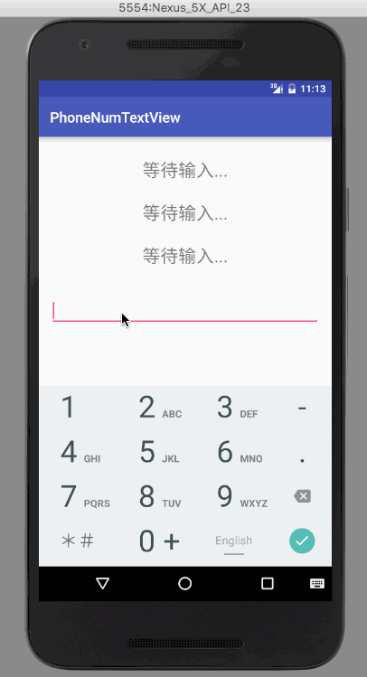

## PhoneNumTextView
* A simple TextView, use it just like other common TextView.
* You can format the phone number yourself by attr: pattern
```
XXX-XXXX-XXXX(pattern=344)
XXXX-XXXX-XXX(pattern=443)
XXX-XXX-XXXXX(pattern=335)
```
* You can use other division mark by attr:division



### step1:
> xml
```
    <cc.biglong.widget.PhoneNumTextView
        app:pattern="344"
        app:division="—"
        android:hint="等待输入..."
        android:gravity="center"
        android:layout_width="match_parent"
        android:layout_height="60dp"
        android:id="@+id/view1"
        android:textSize="25sp"/>
    <EditText
        android:layout_width="match_parent"
        android:layout_height="60dp"
        android:id="@+id/editText"
        android:inputType="phone"/>
```

### step2:
> activity
```
tv1 = (PhoneNumTextView) findViewById(R.id.view1);
et = (EditText) findViewById(R.id.editText);
tv1.setEditText(et);
```

### step3:
> Enjoy it.